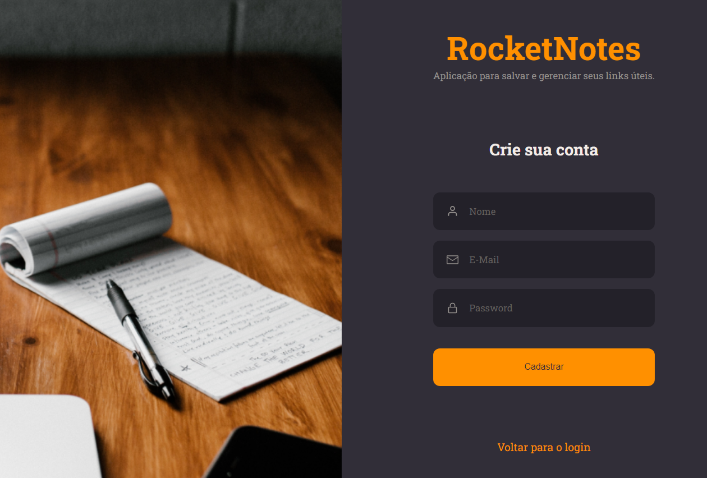

# RocketNotes

## Projeto Rocketnotes - App para anotaçõe importantes com react.js e node.js

## :dart:  Desafio

Projeto Rocketnotes, consiste em construir um app de anotações sobre assuntos  importantes, grardando links e criando tags que viram filtros para selecionar as notas por tags.
Consumindo uma api com nodejs

## :nut_and_bolt: Tech
* NODE
* Express
* Router
* Nodemon
* Controllers
* tratamento de error
* construimos o banco de dados usando a  estrtégia de migrations
* Axios
* knex
* construimos uma API
* REACT
* ESLint e Prettier
* VITE
* STYLED-COMPONENTS
* React-router-dom
* javascript

## :mailbox_closed: Contatos

> Email - rosendc30@gmail.com

> Linkedin - https://www.linkedin.com/in/francisco-rosendo-coelho/

